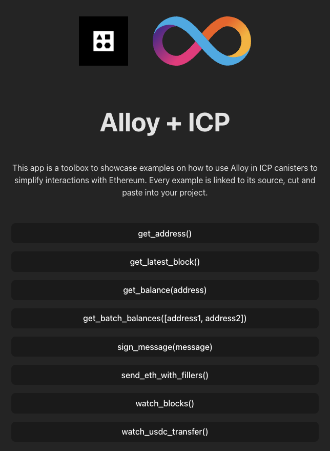

# Alloy + ICP Toolkit

[Alloy](https://alloy.rs/) is the next generation of Ethereum support libraries,
written in Rust and designed for scalability and performance. Alloy is a rewrite
of of [ethers-rs](https://github.com/gakonst/ethers-rs) from the ground up.
Alloy includes built in support for transports like HTTP, WebSockets and IPC.

**Alloy now also works with the Internet Computer (ICP)!**

The Alloy libraries have been forked to add support for ICP as a transport
layer. This makes it possible to use the full feature set of Alloy from ICP
canisters.

This repository contains a collection of examples of how to use Alloy in an IC
context.

- The backend canister interacting with the EVM through Alloy is written in
  Rust.
- The frontend canster uses Vite/React.
- The ic-alloy fork: <https://github.com/kristoferlund/ic-alloy>
- Live demo: <https://u4yi6-xiaaa-aaaap-aib2q-cai.icp0.io>

[![Contributors][contributors-shield]][contributors-url]
[![Forks][forks-shield]][forks-url] [![Stargazers][stars-shield]][stars-url]
[![Issues][issues-shield]][issues-url] [![MIT License][license-shield]](LICENSE)

> [!TIP]
>
> Live demo: <https://u4yi6-xiaaa-aaaap-aib2q-cai.icp0.io>



## Example, get the balance of an address

```Rust
#[ic_cdk::update]
async fn get_balance(address: String) -> Result<String, String> {
    let address = address.parse::<Address>().map_err(|e| e.to_string())?;
    let rpc_service = RpcService::EthSepolia(EthSepoliaService::Alchemy);
    let config = IcpConfig::new(rpc_service);
    let provider = ProviderBuilder::new().on_icp(config);
    let result = provider.get_balance(address).await;

    match result {
        Ok(balance) => Ok(balance.to_string()),
        Err(e) => Err(e.to_string()),
    }
}
```

[get_balance.rs](src/backend/src/service/get_balance.rs)

## Example, sign a message

```Rust
#[ic_cdk::update]
async fn sign_message(message: String) -> Result<String, String> {
    let ecdsa_key_name = "key_1".to_string();
    IcpSigner::new(vec![], &ecdsa_key_name, None)).await.unwrap();
    let signature = signer.sign_message(message.as_bytes()).await.unwrap();
    Ok(format!("{:?}", signature))
}
```

[sign_message.rs](src/backend/src/service/sign_message.rs)

## Setup

There are two main ways to set up and run the project:

### 1. Using a VS Code Dev Container

The dev containers extension lets you use a Docker container as a full-featured
development environment. This repository includes a dev container configuration
that you can use to open the project with all the necessary tools and
dependencies pre-installed.

Pre-requisites:

- [Docker](https://www.docker.com/products/docker-desktop)
- [Visual Studio Code](https://code.visualstudio.com/)
- [Dev Containers Extension](https://marketplace.visualstudio.com/items?itemName=ms-vscode-remote.remote-containers)

Once Docker, Visual Studio Code and the Dev Containers Extension are installed,
you can open the project in a container by clicking the button below:

[](https://vscode.dev/redirect?url=vscode://ms-vscode-remote.remote-containers/cloneInVolume?url=https://github.com/ic-alloy/ic-alloy-toolkit)

### 2. Setup manually

Pre-requisites:

- [Local Internet Computer dev environment](https://internetcomputer.org/docs/current/developer-docs/backend/rust/dev-env)
- [pnpm](https://pnpm.io/installation)

Once you have the prerequisites installed, you can clone this repository and run
the project.

## Running the project

### 1. Start the Internet Computer

```bash
dfx start --background
```

### 2. Install dependencies

```
pnpm install
```

### 3. Deploy the canisters

```
dfx deploy
```

## Collaborators

<!-- readme: collaborators,contributors -start -->
<table>
	<tbody>
		<tr>
            <td align="center">
                <a href="https://github.com/kristoferlund">
                    
                    <br />
                    <sub><b>Kristofer</b></sub>
                </a>
            </td>
            <td align="center">
                <a href="https://github.com/domwoe">
                    
                    <br />
                    <sub><b>Dominic Wörner</b></sub>
                </a>
            </td>
		</tr>
	<tbody>
</table>
<!-- readme: collaborators,contributors -end -->

## License

This project is licensed under the MIT License. See the LICENSE file for more
details.

## Contributing

Contributions are welcome! Please open an issue or submit a pull request if you
have any suggestions or improvements.

[contributors-shield]:
  https://img.shields.io/github/contributors/ic-alloy/ic-alloy-toolkit.svg?style=for-the-badge
[contributors-url]:
  https://github.com/ic-alloy/ic-alloy-toolkit/graphs/contributors
[forks-shield]:
  https://img.shields.io/github/forks/ic-alloy/ic-alloy-toolkit.svg?style=for-the-badge
[forks-url]: https://github.com/ic-alloy/ic-alloy-toolkit/network/members
[stars-shield]:
  https://img.shields.io/github/stars/ic-alloy/ic-alloy-toolkit?style=for-the-badge
[stars-url]: https://github.com/ic-alloy/ic-alloy-toolkit/stargazers
[issues-shield]:
  https://img.shields.io/github/issues/ic-alloy/ic-alloy-toolkit.svg?style=for-the-badge
[issues-url]: https://github.com/ic-alloy/ic-alloy-toolkit/issues
[license-shield]:
  https://img.shields.io/github/license/ic-alloy/ic-alloy-toolkit.svg?style=for-the-badge
[license-url]:
  https://github.com/ic-alloy/ic-alloy-toolkit/blob/master/LICENSE.txt
